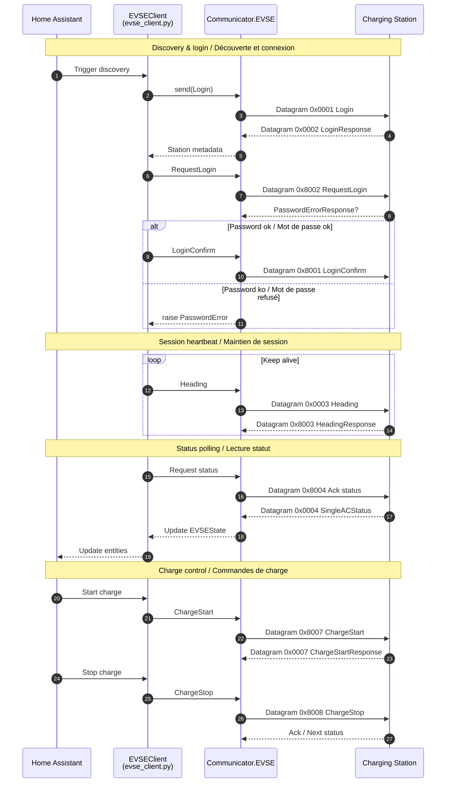

# EVSE Master UDP - Home Assistant Integration

> **🙏 ACKNOWLEDGMENT / REMERCIEMENTS**
> 
> This project is based on the excellent work of [johnwoo-nl/emproto](https://github.com/johnwoo-nl/emproto). Without their invaluable reverse-engineering of the EVSE Master UDP protocol, this Home Assistant integration would not have been possible. Full credit and thanks to the original author! 🌟
> 
> Ce projet est basé sur l'excellent travail de [johnwoo-nl/emproto](https://github.com/johnwoo-nl/emproto). Sans leur précieux reverse-engineering du protocole UDP EVSE Master, cette intégration Home Assistant n'aurait pas été possible. Tout le crédit et nos remerciements à l'auteur original ! 🌟

---

> **🚨 DISCLAIMER / AVERTISSEMENT LÉGAL**
> 
> **English:** This integration is provided "as is". Installing, configuring, or using it is entirely at your own risk. The author(s) accept no liability for any damage, malfunction, warranty loss, fire, injury, or other consequences resulting from its use. Always confirm that your charging station operates safely and complies with local regulations before use.
> 
> **Français :** Cette intégration est fournie "en l'état". Son installation, sa configuration ou son utilisation se font entièrement à vos risques et périls. L'auteur(e) décline toute responsabilité en cas de dommages, dysfonctionnements, perte de garantie, incendie, blessure ou toute autre conséquence liée à son utilisation. Vérifiez toujours que votre borne fonctionne en toute sécurité et respecte la réglementation locale avant usage.

---

> **⚠️ SAFETY WARNINGS / AVERTISSEMENTS IMPORTANTS**
> 
> **English:**
> - Repeated charge starts can prematurely wear your station's contactors; even with safeguards enabled, you assume full responsibility for any damage.
> - Never run the "EVSE Master" mobile app at the same time as this integration; simultaneous use will cause connection conflicts and may crash both systems.
> 
> **Français :**
> - Les démarrages répétés de charge peuvent user prématurément les contacteurs de la borne ; même avec les protections activées, vous assumez l'entière responsabilité des dommages éventuels.
> - N'utilisez jamais l'application mobile « EVSE Master » en parallèle de cette intégration ; l'utilisation simultanée provoque des conflits de connexion et peut faire planter les deux systèmes.

---

> **🗂️ Unified bilingual sections below / Sections bilingues unifiées ci-dessous.**

---

## 📋 Table of Contents / Table des Matières
- [🔌 Overview / Vue d'ensemble](#-overview--vue-densemble)
- [⚠️ Important Warnings / Avertissements](#️-important-warnings--avertissements)
- [🏗️ Compatibility / Compatibilité](#️-compatibility--compatibilité)
- [🚀 Installation](#-installation)
  - [HACS](#hacs)
  - [Manual / Manuelle](#manual--manuelle)
- [⚙️ Configuration](#️-configuration)
- [📊 Entities / Entités](#-entities--entités)
- [🛠️ Features / Fonctionnalités](#️-features--fonctionnalités)
- [🔧 Advanced Configuration / Configuration Avancée](#-advanced-configuration--configuration-avancée)
- [� Automation Examples / Exemples d'automatisations](#-automation-examples--exemples-dautomatisations)
- [🐛 Troubleshooting / Résolution de problèmes](#-troubleshooting--résolution-de-problèmes)
- [🆘 Support](#-support)
- [📄 License / Licence](#-license--licence)

---

## 🔌 Overview / Vue d'ensemble

**EN:** Home Assistant integration for EVSE Master UDP compatible charging stations. Control & monitor your EVSE via the UDP protocol used by the mobile app.

**FR:** Intégration Home Assistant pour bornes compatibles EVSE Master UDP. Contrôle et supervision via le protocole UDP utilisé par l'application mobile.

## ⚠️ Important Warnings / Avertissements

**EN – Built‑in protections:**
- Rapid change protection (≥5 min between start/stop)
- 16A safety fallback on error
- Minimum delay between cycles

**FR – Protections intégrées :**
- Protection changements rapides (≥5 min entre démarrage/arrêt)
- Fallback sécurité 16A en cas d'erreur
- Délai minimum entre cycles

**EN – Recommendations:** Avoid frequent short cycles; plan automations; monitor hardware; disable integration before using the mobile app.

**FR – Recommandations :** Évitez les cycles courts répétés; planifiez vos automatisations; surveillez le matériel; désactivez l'intégration avant d'utiliser l'application mobile.

## 🏗️ Compatibility / Compatibilité

**EN:** Tested: Morec; generic EVSE using UDP 28376; some Chinese stations via EVSE Master.

**FR :** Testé : Morec ; bornes EVSE génériques UDP 28376 ; certaines bornes chinoises via EVSE Master.

## 🚀 Installation

### HACS
**EN:** This is the recommended method because updates are tracked automatically. In Home Assistant open HACS, go to Integrations, then use the three‑dot menu to open Custom repositories. Paste the repository URL `https://github.com/Oniric75/evsemasterudp` and select type "Integration". After adding it, search for "EVSE Master UDP" inside HACS, click install, then restart Home Assistant to load the component.

**FR :** Méthode recommandée car les mises à jour sont suivies automatiquement. Dans Home Assistant ouvrez HACS, allez dans Intégrations puis utilisez le menu (trois points) pour ajouter un Dépôt personnalisé. Collez l'URL `https://github.com/Oniric75/evsemasterudp` et choisissez le type « Integration ». Ensuite recherchez « EVSE Master UDP » dans HACS, installez, puis redémarrez Home Assistant pour charger le composant.

### Manual / Manuelle
**EN:** Use this only if you do not use HACS. Download the latest release archive from GitHub, extract it, and copy the folder `evsemasterudp` (the one that contains `manifest.json`) into your Home Assistant `custom_components/` directory. Ensure the final path is `custom_components/evsemasterudp/`. Restart Home Assistant and the integration should appear in the Add Integration dialog.

**FR :** À utiliser seulement si vous n'utilisez pas HACS. Téléchargez l'archive de la dernière release sur GitHub, extrayez‑la puis copiez le dossier `evsemasterudp` (celui contenant `manifest.json`) dans votre répertoire `custom_components/` de Home Assistant. Vérifiez que le chemin final est `custom_components/evsemasterudp/`. Redémarrez Home Assistant et l'intégration apparaîtra dans la boîte de dialogue « Ajouter une intégration ».

## ⚙️ Configuration

**EN:** During setup you only provide: (1) the EVSE serial number and (2) the password you configured in the official mobile app (plus optional port, default 28376, and name). There is currently no user‑exposed setting for update interval or network timeout; the integration internally refreshes every 60 seconds. Fast‑change protection delay is managed by the numeric entity (see Entities section) rather than in the config flow.

**FR :** Lors de la configuration vous fournissez uniquement : (1) le numéro de série de la borne et (2) le mot de passe défini dans l'application officielle (ainsi que le port optionnel, défaut 28376, et un nom). Il n'existe pas pour l'instant de paramètre utilisateur pour l'intervalle de mise à jour ou le timeout réseau ; l'intégration effectue un rafraîchissement interne toutes les 60 secondes. Le délai de protection contre les changements rapides est géré par l'entité numérique (voir section Entités) et non dans le flux de configuration.

**EN – Fields:**
- Serial: Used to locate and authenticate the charger.
- Password: Required for login (plain text in config entry storage).
- Port: UDP port (keep default unless your device differs).
- Name: Friendly label for entities.

**FR – Champs :**
- Numéro de série : Sert à localiser et authentifier la borne.
- Mot de passe : Requis pour la connexion (stocké en clair dans l'entrée HA).
- Port : Port UDP (laisser la valeur par défaut sauf cas particulier).
- Nom : Libellé convivial pour les entités (défaut: EVSEMaster).

## 📊 Entities / Entités

**EN:** Entities currently implemented (code) are limited to core operational metrics and two number controls. Some earlier documentation placeholders (offline charge, fees) are not yet implemented in this Python port.  
**FR :** Les entités effectivement implémentées (code) se limitent aux métriques principales et à deux contrôles numériques. Certaines entités envisagées (mode hors ligne, tarifs) ne sont pas encore implémentées dans ce port Python.

### Sensors / Capteurs
- `sensor.evse_<serial> État` – **EN:** Meta state (idle/plugged_in/charging/error/offline). **FR :** État simplifié.
- `sensor.evse_<serial> Puissance` – **EN:** Current power (W). **FR :** Puissance instantanée (W).
- `sensor.evse_<serial> Courant` – **EN:** Current on phase L1 (A). **FR :** Courant phase L1 (A).
- `sensor.evse_<serial> Tension` – **EN:** Voltage L1 (V). **FR :** Tension L1 (V).
- `sensor.evse_<serial> Énergie` – **EN:** Cumulative delivered energy (kWh). **FR :** Énergie cumulée (kWh).
- `sensor.evse_<serial> Température Inner/Outer` – **EN:** Internal / external temp (°C). **FR :** Température interne / externe (°C).

### Buttons / Boutons
- `button.<base> Démarrer Charge` – **EN:** Explicit start command. **FR :** Commande explicite de démarrage.
- `button.<base> Arrêter Charge` – **EN:** Explicit stop command. **FR :** Commande explicite d'arrêt.

### Charge Status Sensor / Capteur Statut Charge
 `sensor.<base> Charge Statut` – **EN:** Text status: `charging` / `soft_protection` / `not_charging`. **FR :** Statut texte : `charging` / `soft_protection` / `not_charging`.
  - `soft_protection`: EN: a recent stop prevents immediate restart (cooldown active). FR: un arrêt récent empêche un redémarrage immédiat (protection active).
  - Attribute `cooldown_remaining_s`: seconds remaining before a new start is allowed.

### Numbers / Nombres
 Rapid change protection (default ≥1 min between stop and next start; configurable, can disable with 0)
- `number.evse_<serial> Protection Changements Rapides` – **EN:** Local delay (minutes) between successive start/stop operations to protect hardware. **FR :** Délai local (minutes) entre opérations start/stop pour protéger le matériel.

 Protection changements rapides (défaut ≥1 min entre arrêt et prochain démarrage; configurable, désactivable avec 0)

- Auto discovery / Découverte automatique
- Secure password auth / Authentification sécurisée
- Real-time status / Statut temps réel
- Charge control / Contrôle de charge
- Parameter configuration / Paramètres configurables
- Session history / Historique de session
- Protections intégrées

## 🔧 Advanced Configuration / Configuration Avancée

**EN:** Update freq 15–300s (default 30), timeout 5–30s (default 10), rapid change protection on, 5‑min cycle delay.

**FR :** Fréquence 15–300s (défaut 30), timeout 5–30s (défaut 10), protection active, délai 5 min.

## 📚 Automation Examples / Exemples d'automatisations

### EN: Off‑peak charging / FR : Charge heures creuses
```yaml
automation:
  - alias: "EVSE charge off-peak / heures creuses"
    trigger:
      - platform: time
        at: "22:30:00"
    condition:
      - condition: state
        entity_id: binary_sensor.vehicle_connected
        state: "on"
    action:
      - service: button.press
        target:
          entity_id: button.evsemaster_demarrer_charge
```

### EN: Stop at 80% / FR : Arrêt à 80%
```yaml
automation:
  - alias: "Stop/Arrêt charge 80%"
    trigger:
      - platform: numeric_state
        entity_id: sensor.vehicle_battery_level
        above: 80
    action:
      - service: button.press
        target:
          entity_id: button.evsemaster_arreter_charge
```

## 🐛 Troubleshooting / Résolution de problèmes

**EN:** Not detected → power on, same network, firewall port 28376. Auth failed → check password & serial. Connection lost → network stability, adjust interval, conflicts.

**FR :** Non détectée → alimentation, même réseau, port 28376. Auth échouée → mot de passe & numéro de série. Perte connexion → stabilité réseau, intervalle, conflits.

## 🆘 Support

- Issues / Bugs: https://github.com/Oniric75/evsemasterudp/issues
- Discussions: https://github.com/Oniric75/evsemasterudp/discussions
- Wiki: https://github.com/Oniric75/evsemasterudp/wiki

## 📄 License / Licence

MIT License – see `LICENSE`.

---

## 👨‍💻 Development / Développement

<details>
<summary>🇺🇸 Developer Information / 🇫🇷 Informations pour les développeurs</summary>

### Project Structure / Structure du Projet

```
evsemasterudp/
├── __init__.py          # Integration entry point / Point d'entrée
├── manifest.json        # Integration metadata / Métadonnées
├── config_flow.py       # Configuration interface / Interface de config
├── evse_client.py       # Main EVSE client / Client principal EVSE
├── sensor.py           # Sensors / Capteurs
├── button.py           # Start/Stop buttons / Boutons démarrer/arrêter
├── number.py           # Number controls / Contrôles numériques
├── protocol/           # Protocol implementation / Implémentation protocole
│   ├── __init__.py
│   ├── communicator.py # UDP communication / Communication UDP
│   ├── datagram.py    # Datagram structure / Structure datagrammes
│   └── datagrams.py   # Message types / Types de messages
└── tests/             # Unit tests / Tests unitaires
    ├── test_basic.py
    ├── test_discovery.py
    └── test_full.py
```

### EVSE Master UDP Protocol / Protocole UDP EVSE Master

- **Default port / Port par défaut** : 28376
- **Communication** : Bidirectional UDP / UDP bidirectionnel
- **Authentication / Authentification** : Plain text password / Mot de passe texte
- **Discovery / Découverte** : Automatic broadcast / Broadcast automatique

#### Sequence Overview / Vue séquentielle



### Development Testing / Tests de Développement

```bash
# Activate virtual environment / Activer l'environnement virtuel
.venv/Scripts/activate  # Windows
source .venv/bin/activate  # Linux/Mac

# Basic tests / Tests basiques
python tests/test_basic.py

# Discovery test / Test de découverte
python tests/test_discovery.py

# Full test with real station / Test complet avec vraie borne
python tests/test_full.py
```

### Development Requirements / Prérequis pour le Développement

- Python 3.11+
- Home Assistant Core 2024.1+
- A compatible EVSE station on the local network / Une borne EVSE compatible sur le réseau local

### Protocol Coverage / Couverture du Protocole

This integration implements **75.7% of the TypeScript reference protocol** (30/37 commands):
Cette intégration implémente **75,7% du protocole de référence TypeScript** (30/37 commandes) :

#### ✅ Implemented Commands / Commandes Implémentées (30)
- Authentication: Login sequence (0x8002, 0x0002, 0x0001)
- Status monitoring: Various status commands (0x0003, 0x0004, 0x0005, 0x000d)
- Control: Charging control (0x8104, 0x0104, 0x8105, 0x0105)
- Configuration: Current, fees, system settings (0x8106-0x810d, 0x0106-0x010c)
- Data transfer: Local charge records (0x000a, 0x800a)

#### ❌ Not Implemented / Non Implémentées (7)
- Interface configuration (0x810a, 0x010a, 0x810b, 0x010b)
- Language settings (0x8109, 0x0109)
- Nickname management (0x8108, 0x0108)
- Temperature unit settings (0x810f, 0x010f)

### Contributing / Contributions

Contributions are welcome! / Les contributions sont les bienvenues !

1. Fork the project / Fork le projet
2. Create a feature branch / Créez une branche feature  
   `git checkout -b feature/amazing-feature`
3. Commit your changes / Committez vos changements  
   `git commit -m 'Add amazing feature'`
4. Push to the branch / Pushez vers la branche  
   `git push origin feature/amazing-feature`
5. Open a Pull Request / Ouvrez une Pull Request

### Release Process / Processus de Release

1. Update version in `manifest.json`
2. Create annotated tag: `git tag -a vX.Y.Z -m "Release notes"`
3. Push tag: `git push origin vX.Y.Z`
4. Create GitHub release with changelog

### Testing Guidelines / Directives de Test

- Always test with real EVSE hardware when possible
- Include protocol packet captures for new features
- Test authentication edge cases
- Verify Home Assistant compatibility with recent versions

</details>

---

## 🙏 Acknowledgments / Remerciements

This project is based on the original work of [johnwoo-nl/emproto](https://github.com/johnwoo-nl/emproto) and has been ported and extended for Home Assistant.

Ce projet est basé sur le travail original de [johnwoo-nl/emproto](https://github.com/johnwoo-nl/emproto) et a été porté et étendu pour Home Assistant.